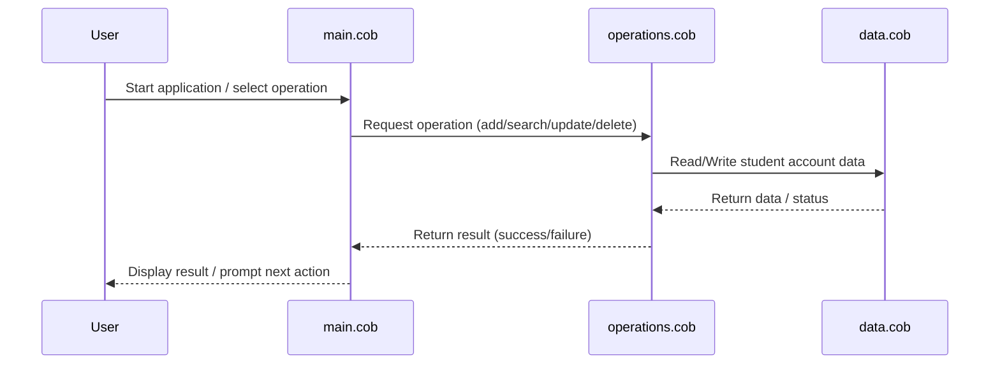

# COBOL Student Accounts System Documentation

This project contains COBOL source files for managing student accounts. Below is an overview of each file, its purpose, key functions, and business rules implemented in the system.

## File Overview

### `main.cob`

- **Purpose:** Entry point for the COBOL application. Handles program initialization, user interaction, and orchestrates calls to other modules.

- **Key Functions:**
  - Program start and termination routines
  - Menu display and user input handling
  - Delegates operations to `operations.cob`

- **Business Rules:**
  - Ensures only valid menu options are processed
  - Handles session control for student account management

### `operations.cob`

- **Purpose:** Contains core business logic for student account operations.

- **Key Functions:**
  - Add, update, and delete student accounts
  - Search and display student account details
  - Validate account data before processing

- **Business Rules:**
  - Student IDs must be unique
  - Account balances cannot be negative
  - Only authorized operations are permitted based on user role

### `data.cob`

- **Purpose:** Defines data structures and storage for student accounts.

- **Key Functions:**
  - Student account record definitions
  - Data initialization and file I/O routines

- **Business Rules:**
  - Data integrity checks during read/write
  - Enforces required fields for each student account (e.g., ID, name, balance)

## Business Rules Summary

- Student accounts must have a unique ID, valid name, and non-negative balance.
- Only authorized users can modify or delete accounts.
- All operations are validated for data integrity before committing changes.

---

For further details, refer to the source code in the `src/cobol/` directory.

## Sequence Diagram: Student Account Data Flow

